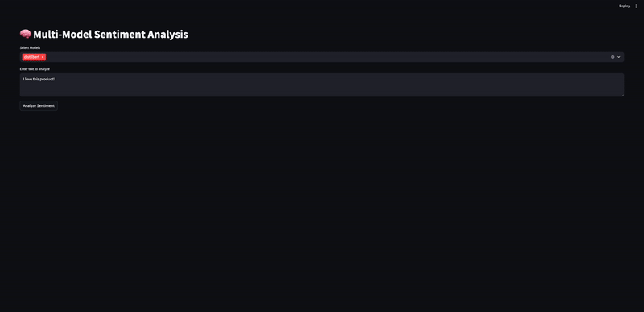

# 🚀 Sentiment Analysis Web App
An AI-powered sentiment analysis tool with a simple web interface that classifies text as Positive, Negative, or Neutral using a pre-trained HuggingFace Transformer model.

---

## 📌 Table of Contents
- [Overview](#-overview)
- [Demo](#-demo)
- [Features](#-features)
- [Tech Stack](#-tech-stack)
- [Project Structure](#-project-structure)
- [Setup & Installation](#-setup--installation)
- [Usage](#-usage)
- [Results](#-results)
- [Future Improvements](#-future-improvements)
- [Contributing](#-contributing)
- [License](#-license)

---

## 📝 Overview
This project is a web application that performs real-time sentiment analysis on user-provided text. It solves the problem of quickly understanding emotional tone in text content, which is valuable for customer feedback analysis, social media monitoring, and market research. The application uses a pre-trained HuggingFace Transformer model served through a FastAPI backend with a Streamlit frontend.

---

## 🎥 Demo


---

## ✨ Features
- ✅ Real-time sentiment prediction
- ✅ Confidence score display
- ✅ Clean, responsive UI
- ✅ Built with Streamlit & HuggingFace

---

## 🛠 Tech Stack
**Languages & Frameworks:** Python, Streamlit, FastAPI  
**ML Tools:** HuggingFace Transformers, PyTorch  
**Deployment:** Local development with Uvicorn

---

## 📂 Project Structure
```bash
.
├── backend/            # FastAPI backend code
│   └── main.py
├── frontend/           # Streamlit frontend code
│   └── app.py
├── requirements.txt    # Python dependencies
├── README.md           # Project documentation
```

---

## ⚙️ Setup & Installation

```bash
# Clone repo
git clone https://github.com/vinaykagithapu/sentiment-analysis-app.git
cd sentiment-analysis-app

# Create virtual environment
python -m venv .venv
source .venv/bin/activate  # On Windows use: .venv\Scripts\activate

# Install dependencies
pip install -r requirements.txt

# Configure HF Token
export HUGGING_FACE_HUB_TOKEN=<your_huggingface_token>
```

---

## 🚀 Usage
1. Start backend server
```bash
# Start the Backend
uvicorn backend.main:app --reload --port 8000
```
2. Example API Request:
```bash
# List the models
curl -X GET http://localhost:8000/models

# Infer
curl -X POST "http://localhost:8000/predict" \
    -H "Content-Type: application/json" \
    -d '{
          "text": "I love this product!",
          "models": ["distilbert", "bertweet"]
     }'
```
3. Start frontend server and visit UI at http://localhost:8501/
```shell
# Start Frontend App
streamlit run frontend/app.py
```
4. Example inputs
```shell
I absolutely love this product! It exceeded my expectations.
This is the worst experience I’ve ever had.
The package arrived yesterday.
The movie started off boring but ended with an amazing twist.
The company’s quarterly earnings exceeded analyst expectations, sending the stock price up 8%.
Shares plunged after the CEO announced a significant drop in projected revenue for the next quarter.
The bank released its annual financial report this morning, outlining changes in its loan portfolio.
Revenue increased in North America but sharp losses in European markets offset most of the gains.
```

---

## 📊 Results
The application provides:
- Instant sentiment classification (Positive/Negative/Neutral/Mixed)
- Confidence scores for each prediction
- Clean visualization of results

---

## 🔮 Future Improvements
- Add GPU optimization for faster inference
- Expand supported languages beyond English
- Deploy to cloud platform for public access
- Add batch processing capability

---

## 🤝 Contributing
Pull requests are welcome! Please fork the repo and submit a PR for review.

---

## 📄 License
This project is licensed under the MIT License - see the [LICENSE](LICENSE) file for details.
