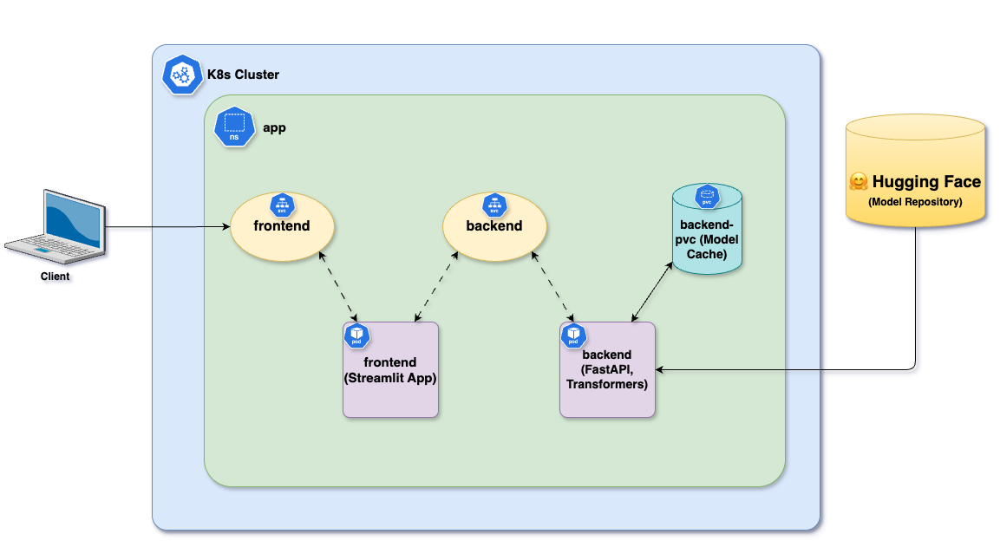

# Deploy in K8s

## Setup K8s Clusters
1. Create kubernetes cluster (v1.31.4) using kind.
```shell
kind create cluster --name poc --image kindest/node:v1.31.4
```
2. Verify the cluster status
```shell
kubectl get nodes
```

# Deployment Architecture


## Build Docker Images & Load
1. Build the [backend docker image](../../backend/)
2. Build the [frontend docker image](../../frontend/)
3. Load the images into kind k8s nodes
```shell
kind load docker-image sentiment-analysis:backend --name poc
kind load docker-image sentiment-analysis:frontend --name poc
```

## Deploy in K8s
1. Create namespace
```shell
kubectl create namespace app
```
2. Create backend and frontend deployment
```shell
kubectl -n app apply -f backend.yaml
kubectl -n app apply -f frontend.yaml
```
3. Check the status
```shell
kubectl -n app get pods
kubectl -n app logs -l app=backend
kubectl -n app logs -l app=frontend
```

## Verify
1. Port-forward `backend` service
```shell
kubectl -n app port-forward svc/backend 8000:80
```
2. Verify the backend APIs
```shell
# List the models
curl -X GET http://localhost:8000/models

# Infer
curl -X POST "http://localhost:8000/predict" \
    -H "Content-Type: application/json" \
    -d '{
          "text": "I love this product!",
          "models": ["distilbert", "bertweet"]
     }'
```
3. Port-forward `frontend` service
```shell
kubectl -n app port-forward svc/frontend 8080:80 
```
4. Access the UI at http://localhost:8080
5. Verify with example inputs
```shell
I absolutely love this product! It exceeded my expectations.
This is the worst experience I’ve ever had.
The package arrived yesterday.
The movie started off boring but ended with an amazing twist.
The company’s quarterly earnings exceeded analyst expectations, sending the stock price up 8%.
The bank released its annual financial report this morning, outlining changes in its loan portfolio.
```

# CleanUp
```shell
kubectl -n app delete -f frontend.yaml
kubectl -n app delete -f backend.yaml
kubectl delete namespace app
kind delete cluster --name poc
```